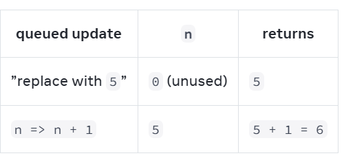

### Interaction with useState()
- everytime we use setSomething() to change the state, react will rerender the whole component with the new state.
- Use a state variable when a component needs to “remember” some information between renders.
- different/same component will not share same state. state is fully private and isolated to only the one component.
    ```jsx
    function component() {...}

    function app() {
        return (
            <>
                <component />
                <component />
            </>  
        )
    }
    ```
    - In this case, state in first component wont affect second component at all.
    - Also notice how the app component doesn’t “know” anything about the Component state or even whether it has any. Unlike props, state is fully private to the component declaring it. 
- Hooks can only be called at the top level of the component function

### Render and commit
- component render can be triggered by following 2 reasons:
  - initial render
  - state update or its ancestor's state updated:
    - update the component's state automatically queues a render.
- React renders our components:
  - render is recursive: if the updated component returns some other component, React will render that component next, and if that component also returns something, it will render that component next, and so on. The process will continue until there are no more nested components and React knows exactly what should be displayed on screen.
- React commits changes to the DOM:
  - after rendering(calling) cour components, react will modify the DOM
  - react only commit the part that is different than before to DOM, others stay same. React only changes the DOM nodes if there’s a difference between renders

### State as a Snapshot
**will learn**
- Setting state requests a new render.
- React stores state outside of your component, as if on a shelf.
- When you call useState, React gives you a snapshot of the state for that render.
- why state does not update immediately after you set it.
  - answer: in the current component render, you use current state value's snapshot(substitute the current value into component) to calculate the component, and new state value's snapshot will be used to calculate next component render.
  
  ```jsx
  export default function Counter() {
    const [number, setNumber] = useState(0);
    return (
      <>
        <h1>{number}</h1>
        <button onClick={() => {
          setNumber(number + 1);
          setNumber(number + 1);
          setNumber(number + 1);
        }}>+3</button>
      </>
    )
  }
  ```
  Here is what this button’s click handler tells React to do:

  1. setNumber(number + 1): number is 0 so setNumber(0 + 1).
  React prepares to change number to 1 on the next render.
  2. setNumber(number + 1): number is 0 so setNumber(0 + 1).
  React prepares to change number to 1 on the next render.
  3. setNumber(number + 1): number is 0 so setNumber(0 + 1).
  React prepares to change number to 1 on the next render.

  Even though you called setNumber(number + 1) three times, in this render’s event handler number is always 0, so you set the state to 1 three times. This is why, after your event handler finishes, React re-renders the component with number equal to 1 rather than 3
  
- How event handlers access a "snapshot" of the state


### Queueing a Series of State Updates:
sometimes we need to perform multiple operations on the value before queueing the next render.

**Will learn:**
- What "batching" is and how React uses it to process multiple state updates.
- How to apply several updates to the same state variable in a row.

**React batches state updates:**
- re-render only happens after the whole event handler code is finished running. like a waiter doesn't run to kitchen to  kitchen at the mention of your first dish. instead, they let you finish order, let you make change to it, and even take orders from other people at table.
- This lets me update multiple state variable--even from multiple components--without triggering too many re-renders. But this also means UI wont be updated until after event handler. This is known as **batching**. **but when we meet asynchronous code like await/setTimeOut,we dont wait for them, we re-render right after synchronous part ends. we batch code per tick, before the wait is one tick, after the tick is the other tick.**

**Updaing the same state multiple times before the next render**
- if you would like to update the same state variable multiple times before the next render, instead of passing the next state value like setNumber(number + 1), you can pass a function that calculates the next state based on the previous one in the queue, like setNumber(n => n + 1). 
  ```jsx
  import { useState } from 'react';

  export default function Counter() {
    const [number, setNumber] = useState(0);

    return (
      <>
        <h1>{number}</h1>
        <button onClick={() => {
          setNumber(n => n + 1);
          setNumber(n => n + 1);
          setNumber(n => n + 1);
        }}>+3</button>
      </>
    )
  }
  ```
  Here, n => n + 1 is called an updater function. When you pass it to a state setter:

  React queues this function to be processed after all the other code in the event handler has run.
  During the next render, React goes through the queue and gives you the final updated state
  Here’s how React works through these lines of code while executing the event handler:

  `setNumber(n => n + 1): n => n + 1` is a function. React adds it to a queue.
  `setNumber(n => n + 1): n => n + 1` is a function. React adds it to a queue.
  `setNumber(n => n + 1): n => n + 1` is a function. React adds it to a queue.
  When you call useState during the next render, React goes through the queue. The previous number state was 0, so that’s what React passes to the first updater function as the n argument. Then React takes the return value of your previous updater function and passes it to the next updater as n, and so on:
  

**What happens if you update state after replacing it?**
  ```jsx
      import { useState } from 'react';

      export default function Counter() {
        const [number, setNumber] = useState(0);

        return (
          <>
            <h1>{number}</h1>
            <button onClick={() => {
              setNumber(number + 5);
              setNumber(n => n + 1);
            }}>Increase the number</button>
          </>
        )
      }
  ```
Here is what this event handler tells React to do:
  1. setNumber(number + 5): number is 0, so setNumber(0 + 5). React adds “replace with 5” to its queue
  2. setNumber(n => n + 1): n => n + 1 is an updater function. React adds that function to its queue.
  
  
During the next render, React goes through the state queue:\

  
**What happens if you replace state after updating it:**
  ```jsx
    export default function Counter() {
      const [number, setNumber] = useState(0);

      return (
        <>
          <h1>{number}</h1>
          <button onClick={() => {
            setNumber(number + 5);
            setNumber(n => n + 1);
            setNumber(42);
          }}>Increase the number</button>
        </>
      )
    }
  ```
  Here's how React works through these lines of code while executing this event handler:
  1. `setNumber(number + 5)`: number is 0, so setNumber(0 + 5). React adds “replace with 5” to its queue.
  2. `setNumber(n => n + 1)`: n => n + 1 is an updater function. React adds that function to its queue.
  3. `setNumber(42)`: React adds “replace with 42” to its queue.
  
  During the next render, React goes through the state queue:
  

**Recap:**
- Setting state does not change the variable in the existing render, but it requests a new render.
- React processes state updates after event handlers have finished running. This is called batching.
- To update some state multiple times in one event, you can use setNumber(n => n + 1) updater function.
  
### Updating Objects in State

**will learn**
- How to correctly update an object in React state
- How to update a nested object without mutating it.
- what immutability is, and how not to break it.
- How to make object copying less repetitive with lmmer

**Whats mutation**
- immutable Example: value `setX(5)`. the x state changed from 0 to 5, but the number 0 itself didnt change. Its not possible to make any changes to the built-in primitive values like numbers and booleans in JS. 

- Example: `const [position, setPosition] = useState({ x: 0, y: 0 });`
  - Object is mutable. we are able to change the contents of the object isself, this is called **mutation** `position.x = 5;`

**Treat State as ready-only**
- whne trying to update a state, dont mutate it but create a new object and replace the old state with setter function. React has no idea the object has changed if you just mutate it and React does not do anything in response.
- Example:
```jsx
  import { useState } from 'react';

  export default function MovingDot() {
    const [position, setPosition] = useState({
      x: 0,
      y: 0
    });
    return (
      <div
        onPointerMove={e => {
          setPosition({
            x: e.clientX,
            y: e.clientY
          });
        }}
        style={{
          position: 'relative',
          width: '100vw',
          height: '100vh',
        }}>
      </div>
    );
  }

```

**Copying objects with the spread syntax**
- Good Example:
  ```jsx
    setPerson({
      firstName: e.target.value, // New first name from the input
      lastName: person.lastName,
      email: person.email
    });
  ```
- Excellent Example: You can use the `...` object spread syntax so that you don’t need to copy every property separately.
  ```jsx
    setPerson({
      ...person, // Copy the old fields
      firstName: e.target.value // But override this one
    });
  ```
- Best Example: Using a single event handler for multiple fields.
  ```jsx
    export default function Form() {
      const [person, setPerson] = useState({
        firstName: 'Barbara',
        lastName: 'Hepworth',
        email: 'bhepworth@sculpture.com'
      });

      function handleChange(e) {
        setPerson({
          ...person,
          //  use the [ and ] braces inside your object definition to specify a property with a dynamic name.
          [e.target.name]: e.target.value //"name" is specified in tag
        });
      }

      return (
        <>
          <label>
            First name:
            <input
              name="firstName"
              value={person.firstName}
              onChange={handleChange}
            />
          </label>
          <label>
            Last name:
            <input
              name="lastName"
              value={person.lastName}
              onChange={handleChange}
            />
          </label>
          <label>
            Email:
            <input
              name="email"
              value={person.email}
              onChange={handleChange}
            />
          </label>
          <p>
            {person.firstName}{' '}
            {person.lastName}{' '}
            ({person.email})
          </p>
        </>
      );
    }
  ```
  
**Updating a nested object**
- Example:
  ```jsx
    const [person, setPerson] = useState({
      name: 'Niki de Saint Phalle',
      artwork: {
        title: 'Blue Nana',
        city: 'Hamburg',
        image: 'https://i.imgur.com/Sd1AgUOm.jpg',
      }
    });

    const nextArtwork = { ...person.artwork, city: 'New Delhi' };
    const nextPerson = { ...person, artwork: nextArtwork };
    setPerson(nextPerson);

    // or single function call:
    setPerson({
      ...person, // Copy other fields
      artwork: { // but replace the artwork
        ...person.artwork, // with the same one
        city: 'New Delhi' // but in New Delhi!
      }
    });
  ```

**Write concise update logic with Immer When super nested object**

Immer is a popular library that lets you write using the convenient but mutating syntax and takes care of producing the copies for you. With Immer, the code you write looks like you are “breaking the rules” and mutating an object:

```jsx
  updatePerson(draft => {
    draft.artwork.city = 'Lagos';
  });
```

But unlike a regular mutation, it doesn’t overwrite the past state! A complete example using immer below. replace useState with useImmer

```jsx
  import { useImmer } from 'use-immer';

  export default function Form() {
    const [person, updatePerson] = useImmer({
      name: 'Niki de Saint Phalle',
      artwork: {
        title: 'Blue Nana',
        city: 'Hamburg',
        image: 'https://i.imgur.com/Sd1AgUOm.jpg',
      }
    });

    function handleNameChange(e) {
      updatePerson(draft => {
        draft.name = e.target.value;
      });
    }

    function handleTitleChange(e) {
      updatePerson(draft => {
        draft.artwork.title = e.target.value;
      });
    }

    function handleCityChange(e) {
      updatePerson(draft => {
        draft.artwork.city = e.target.value;
      });
    }

    function handleImageChange(e) {
      updatePerson(draft => {
        draft.artwork.image = e.target.value;
      });
    }

    return (
      <>
        <label>
          Name:
          <input
            value={person.name}
            onChange={handleNameChange}
          />
        </label>
        <label>
          Title:
          <input
            value={person.artwork.title}
            onChange={handleTitleChange}
          />
        </label>
        <label>
          City:
          <input
            value={person.artwork.city}
            onChange={handleCityChange}
          />
        </label>
        <label>
          Image:
          <input
            value={person.artwork.image}
            onChange={handleImageChange}
          />
        </label>
        <p>
          <i>{person.artwork.title}</i>
          {' by '}
          {person.name}
          <br />
          (located in {person.artwork.city})
        </p>
        
      </>
    );
  }

```