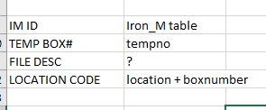
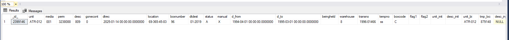
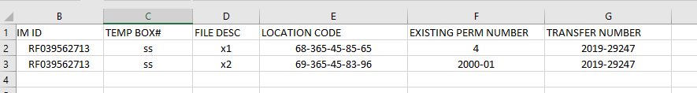
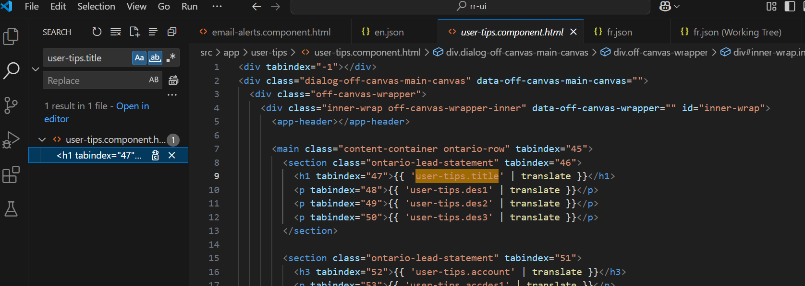
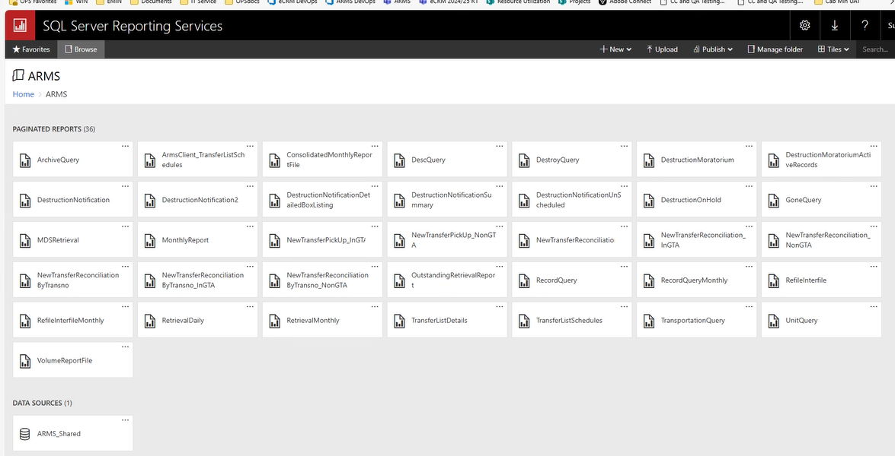
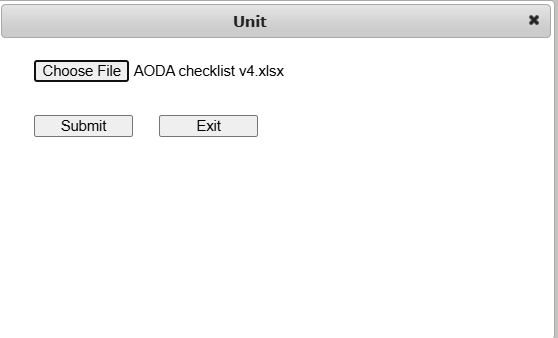
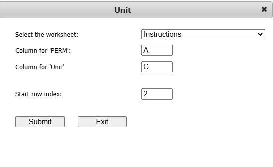
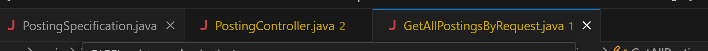

## 2024-01-14 To-do List:
- [x] set up sql server management studio(SSMS).            
- [x] testing for ARMS create cross reference                            
- [x] learn sql basics, select & join                                      
- [x] learn powerapps basics
- [ ] learn C# & .NET                                          
- [x] double check LRS with Audit                                           
- [ ] js continue one chapter


#### Question for ARMS:
- [x] column header name is different between database and template.      
    
   
   - FILE DESC is in table `ARMS_add_iron`.
- [x] if there are two rows of child, why there is only one new perm number. add a testing case and a requirement for duplicate IM ID case
   
   - since two IM ID are the same, so probably the system handles the duplicate for IM ID, so it gave just one new perm number.
   - but it is not how we wanna handle it, we want a error message on the screen and stop the process instead of a confirmation email.
   - add IM ID case into testing case and requirement, expected to have err msg and stop the process.
- [x] when got email confirmation. 
   - not a problem anymore in the second day. 
    
#### Questions for RLS:
1. whenever a user submitted a form by LRS, how they retrieve the submission/construction plans.


## 2024-01-15
#### Office: 
- [X] add duplicate IM ID case into requirement & testing case
- [X] clarify the questions from the day before 
- [X] Improved the sharePoint error report excel sheet 
- [X] go through the tests have tested already for creating corss reference      
    - retest with checking data in database is correct         
    - improve testing excel spread sheet.
- [ ] start on LRO, work on some UI by powerapps
- [ ] Learn basics of .NET

#### Home:
- [X] home: JS


#### question for ARMS Testing:
- [X] dtrecord in database is different is ok?
- [X] tmp_loc is different is ok?
- [X] two rows have same new perm number is ok? should I add into requirement email confirmation validation and testing cases?
   - it was my bad, the first two rows are headers. process statring from third row.

## 2024-01-16
- [ ] 1. Learn basics of .NET
- [X] 2. go through BR-7 Change Record Status 
- [X] Ask for some works from Kal's team.
- [X] Ask questions about the ARMS from yesterday
- [X] 4. JS
- [X] Access WIN
- [X] regulatory registry 
- [X] make a testing case for ARMS new feature and test it tonight.

## 2024-01-17 -> 01-19
- [X] 1. testing BR-7 Change record Status:
  - [X] use perm number to search and see if updated 'status' in table matches what has been selected.
  - [X] perm number does not exist in database should display error.
- [X] 2. test for BR-4 Locate and Change Box Menu - Modifying search Fields test 1-7
  - [X] 1. search box by transfer # only 
  - [X] 2. search box by temp box # only
  - [X] 3. search both transfer # and temp box # same time.
  - [X] 4. search box by unexisting transfer # only. Expect a error message 
  - [X] 5. search box by unexisting temp box # only. Expect a error message
  - [X] 6. search box by unexisting transfer # & unexisting temp box #. Expect a error message 
  - [X] 7. test if the new field combined legacy location and box # can search properlly
  - [X] 8. test unexisting location # for 7.
- [ ] 3. learn how to build a .NET backend API.
- [X] 4. retest all pages for RR on next Monday.
- [X] 5. access request for RR repo
- [X] 6. set up RR repo locally.
  - [X] ui -> code . -> node.js version 18.20.4 -> install angular -> mpm install libraries & ng serve 
  - [X] & api -> code . 
  - [X] SDK 1.8
- [X] 7. retest create cross reference in testing spread sheet
- [X] 8. Fix defect 232 
- [X] 9. Fix defect 231
- [X] 10. JS one chapter today
- [x] 11. PD8 


## 2024-01-17 -> 01-19 2.0
- [X] 1. JS one chapter today 
- [X] 2. PD8 
- [ ] 3. learn how to build a .NET backend API.
- [X] 4. test for BR-4 Locate and Change Box Menu - Modifying search Fields test 1-7
  - [X] 1. search box by transfer # only 
  - [X] 2. search box by temp box # only
  - [X] 3. search both transfer # and temp box # same time.
  - [X] 4. search box by unexisting transfer # only. Expect a error message 
  - [X] 5. search box by unexisting temp box # only. Expect a error message
  - [X] 6. search box by unexisting transfer # & unexisting temp box #. Expect a error message 
  - [X] 7. test if the new field combined legacy location and box # can search properlly
  - [X] 8. test unexisting location # for 7.
- [X] 5. make a phase 3 doc for ARMS

## 2024-01-20 - 01-21
- [X] 0. database sql process
- [X] 0. create a new spreed sheet for BR-4.
- [X] 0. created phase 3 document
- [X] 1. test for BR-4 Locate and Change Box Menu - Modifying search Fields test 1-7
  - [X] 1. search box by transfer # only 
  - [X] 2. search box by temp box # only
  - [X] 3. search both transfer # and temp box # same time.
  - [X] 4. search box by unexisting transfer # only. Expect a error message 
  - [X] 5. search box by unexisting temp box # only. Expect a error message
  - [X] 6. search box by unexisting transfer # & unexisting temp box #. Expect a error message 
  - [X] 7. test if the new field combined legacy location and box # can search properlly
  - [X] 8. test unexisting location # for 7.

### home: 
- [X] 3. JS one chapter today
- [X] 4. PD8 

## 2024-01-22
- [X] 1. test for BR-4 Locate and Change Box Menu - Modifying search Fields test 1-7
  - [X] 1. search box by transfer # only 
  - [X] 2. search box by temp box # only
  - [X] 3. search both transfer # and temp box # same time.
  - [X] 4. search box by unexisting transfer # only. Expect a error message 
  - [X] 5. search box by unexisting temp box # only. Expect a error message
  - [X] 6. search box by unexisting transfer # & unexisting temp box #. Expect a error message 
  - [X] 7. test if the new field combined legacy location and box # can search properlly
  - [X] 8. test unexisting location # for 7.
- [X] 2. make a phase 3 doc for ARMS( requirement is in the teams)
  - [X] br-8 2 is moved to phase 3
  - [X] br-8 3 is moved to phase 3 as well.
  - [X] bring the following BRs from the master doc to the new doc: BR-3, BR-9, BR-10, BR-11
- [X] 3. react 40mins
- [ ] 5. defect 12:
  - [ ] find the style sheet for user Tips
  - [ ] copy the style into glossory
  - [X] find the file for User Tips pages
  

## 2024-01-23
- [X] 1. react lesson 1
- [X] testing for RR
- [X] defecet 12 fix for RR
- [X] 2. react lesson 2
  
## 2024-01-24
- [X] 1. react lesson 2
- [X] 2. react lesson 3

## 2024-01-28
- [] 1. BR-8 testing
- [X] 2. react lesson 4
- [X] 3. defect 225
- [X] 4. defect 275

## 2024-01-29
- [X] 1. ASA recording review (review it in 40 mins)
- [X] 2. admin ticket handle (ask in meeting)
- [X] 3. Winnie request on ticket handling report and email
- [ ] 4. BR-8 Testing 
- [X] 5. 200
- [ ] 6. amazon issue 
- [ ] 7. book immigration consulting
- [ ] 8. review the recording with businees for ARMS and documentation

ASA:
primary tasks are:
 
Create a flow chart (work off the one that Eric already made)
Figure out how the data is going to be ingested (how it is going to be captured from the initial form) high level
Figure out how the primary parts of the workflow are going to be conducted

link: 
[ASA link](ASA business requirements swimlane - 3080 × 1080px)

## 2024-01-31
- [X] 0. WIN 
- [X]  0.1 defect 
- [X]  0.2 ASA flow chart
- [X] 1. admin ticket handling
- [X] 2. BR-8 Testing
  - [X] 1. access: some branches within a minitry, search by the ministry - expect to show records in those branches only
  - [X] 2. access: some ministries. search by branch inside  - expect to have access to all branches inside
  - [X] 3. search by branch and ministry that account has no access. - expect to have error message
  - [X] 4. test admin account
- [ ] 3. review the recording with businees for ARMS and documentation
- [ ] 6. react one lesson
- [X] 4. amazon issue 
- [ ] 5. book immigration consulting


## 2024-02-01
- [X] 0. delete nongyeyinhang app
- [ ] 1. review the recording with businees for ARMS and documentation
- [X] 2. react half lesson
- [ ] 3. book immigration consulting


## 2024-02-02
- [X] 1. react one lesson
- [ ] 2. needs to complete practice
- [ ] 3. review the recording with businees for ARMS and documentation
- [X] 4. book immigration consulting

## 2024-02-03
- [X] 0. business requirement for ARMS (one br left to watch and organize the requirement)
- [X] 1. check UI design for RR, come up with questions, log question somewhere
- [X] 3. pd assignment
- [X] 4. course selection

- [ ] 1. find some more react tut and build some more project
- [X] 2. review the recording with businees for ARMS and documentation
- [ ] 3. book immigration consulting


## 2024-02-05
- [] 0. set up back office (in progress)
- [X] 0. defect 225
- [ ] 1. continue working on react project on the side
- [ ] 2. book immigration consulting

## 2024-02-06
- [X] 1. check phase 2 functions (4 features)
- [X] 2. set up back Office
  - [X] question: why I got the error when I `npm run start` after `npm install`
- [] 3. typescript
- [] 4. work on RR component
- [] 5. try make the hard code dynamic for the database name, learn in the link ivan selection

## 2024-02-07
- [X] 1. question for RR:
  - [X] how do I know what argument the ontario react component needs? e.g. <OntarioHeader a="" b=""/>
  - [X] for now just use class of ontario design instead of using component.
- [ ] 2. finish TypeScript basics ********today******
- [X] 3. ARMS table dynamic DS name
- [ ] 4. continue with js react  **********today*********
- [X] 5. business requirement email draft:
  - [X] 3 reports? confirm. give us the list of reports they want to have the analysis archival field.
path
  - [ ] add a path to requimren phase 3 **********today*********
  - [X] NOT RECOMMENDED. it is free text, cost time, slow. originating search field. what kind of method they need to search?? partial match? prefix??
not rush:
- [ ] 6. work with Ivan on some BRs.

dynamic version sp:
wait for permisson on UAT access
test DEV and UAT between original sp reault and dynamic sp result

## 2024-02-08
- [X] finish TypeScript basics
- [ ] continue js react project
- [X] test sp
  - [X] compare the result of new version and old version, should be same
  - [X] make one more for the other table


## 2024-02-10
- [X] Stored procedure follow up
  - [X] replace the original one to the new ones
  - [X] test front end 
- [X] Component follow up.
  - [X] store the welcome page into seperate folder other than common folder 
- [X] SSO:
  - [X] do some research on the SSO(two docs and video)
  - [ ] documentation
- [X] charge keyboard


## 2024-02-11
- [X] look into how we deploy stored procedures from one db to another.
- [X] SSO quesitons:
  - [X] whats the expected behaviour of this SSO
  - [X] Luix's SSO seems working without err on my end. 
  - [X] documentation (where to put?)
- [X] SSO
  - [X] documentation in wiki:
    - [X] microsoft doc + azure AD groups + set updated
- [ ] gym react in ts for 1 hour

## 2024-02-12
- [X] come up with questions for tmr enhancement
  - [X] which DB table update AA? -> ARMS record table
  - [X] only need originating office for report not search field anymore
  - [X] no need for large report query anymore
  - [X] BR-10 masss archival analysis update: box identifier(perm number), column AA needs to be updated.
  - [X] BR-10 record to destroy -> records will be removed from arms_record table and add to destory table.
  - [X] new br other requirement, delate large report query anymore, maselanous -> officer -> second button recrod large reports delete.
  - [X] walk through the SSO code (auth -> context. service. app.tsx)
  - [X] put the component into the correct position
- [X] spring page for ARMS


## 2024-02-13
- [X] canvas two new mockups, edit on that.
- [X] refix 225 defect.

- [X] wait for err component and news component
    
- [X] gym app development
 

## 2024-02-14
- [X] RR
  - [X] SSO improvement. move message into console
  - [X] make greeting user name dynamic
  - [X] Implementation for valid user check
  - [X] correct style for Greeting Message
- [X] ARMS end of March:
  - [X] get access to ARMS folder(UAT directory)

- [X] night:
  - [X] gym app development
  - [ ] correct to dynamic stored procedure for every others  

sql server report service
report builder install, eidt -> 
click parameter to add parameter
data source
create new arms data source in server connects to dev env. 
research: sql database cerate a new report center


03 -> dev UAT
04 -> prod

## 2024-02-15
- [X] RR
  - [X] basic AG grid
  - [X] gym app development for 30mins (2.30 hours left)
  - [ ] do some AG grid research on how to make style on it.
- [X] ARMS end of March:
  - [ ] modify fields in ARMS folder( UAT directory)

## 2024-02-16
- [X] ski, rest

## 2024-02-17
- [X] RR
  - [X] gym app development for 30mins (2 hours left) 1.
  - [ ] do some AG grid research on how to make style on it. 3.
  
- [X] ARMS
  - [X] modify fields in ARMS folder( UAT directory) 2.

## 2024-02-18
Regulatory Registry:
- [X] (ask jinyu for the image / ask business for the image, should be done by Thusday)
- [X] add backgroud into UI
- [X] question: 
    - [X] when login with non-ontario microsoft account, what kind of page is expected? (Try use my school email to log in)
    - [X] after I had a props, and I change my css, the error shows up, need to restart front end.

ARMS:
- [X] question:
  - [X] seems like the options for second row come from the database fields, but now, I cannot choose a field called "arch_analysis" even if I added a new column in UAT record table 
  - [X] where is the dataset?
  - [X] why cannot find the table in the dataset?
    - [X] becuase the dataset I see in the report builder is the coressponding table to that report
  - [X] why after I added into ARMS report folder, DEV got updated with two fields?
    - [X] because both UAT and DEV envs are using `ARMS reports folder`
- [X] add a field and search field "Archival_Analysis" in ARMS folder( UAT directory)
- [X] add field(search & column) in coressponding table, add new field in query, and then add new field in seperate report folder,  

## 2024-02-19
Regulatory Registry:

- [X] Integrate Eric's component
- [X] resolve merge conflict          1.
- [X] improve error page              2.
- [X] make the greeting component dynamic. 3. shift to tmr
- [X] demo:
  - [X] reuqest number api is not ready, so hard code it for now.
  - [X] newsupdate, hide the VIEW ALL for now.
  - [X] hide AG grid for now.
- [X] position video 

ARMS:
- [X] fields for Archival_Analysis 
  - [X] add field in coressponding table (ARMS_record) -> select a new field from ARMS_record into ARMS_VIEW_RECORD_QUERY -> add new field in ARMS_VIEW_RECORD_QUERY in report builder -> and then add new field in seperate report folder,  
  - [X] Test the Archival_Analysis fields added into the report
    - [X] search by other fields e.g. perm
    - [X] search by Archival_Analysis itself, it would take forever to generate the report
      - [X] the cause is that I didnt add a search criteria in the report builder query. add that into query.
- [X] fields for RFID
  - [X] add column RFID into `ARMS_VIEW_record_query` table
  - [X] select a the field in report builder for record query report.
  - [X] search by other fields e.g. perm
  - [X] search by Archival_Analysis itself, it would take forever to generate the report
  - [X] delete RFID both fields
- [X] fields for originating_office
  - [X] add the field `RFID` into  `ARMS_add_iron` and do left join into `ARMS_VIEW_RECORD_QUERY`
  - [X] select a new field from `ARMS_add_iron` into `ARMS_VIEW_RECORD_QUERY`
  - [X] search by RFID itself causing searching issue.
  - [X] delete originating_office search field

## 2024-02-20
RR:
- [X] make the greeting request dynamic.  
- [X] Menu bar  
  - [X] admin/manager: clicking report goes to power BI for admin/manager
  - [X] editor: clicking report goes to one for editor and a create button


ARMS:
- [X] search by Archival_Analysis itself, it would take forever to generate the report
    - [X] the cause is that I didnt add a search criteria in the report builder query. add that into query. 2
- [X] delete RFID both fields 
- [X] delete originating_office search field 
- [X] add fields for remainning ones.
- [X] new index for desc in ARMS_records table
- [X] new index for ARMS_desc table descode field


## 2024-02-21
RR:
- [ ] delete French
- [X] DEV session time out. 
  - [X] research
  - [X] implement

ARMS:
- [X] current issues:
  - [X?] iron_m table has the RFID, but this table is in messy, alot of duplicate, need to clean up first before use this table.
    - [X?] one solution is to clean it up, the other is to abandon this table and add a RFID column in other tbale and use other table.
  - [X] export inventory has something weird behavious
- [ ] locate & change report - archival analysis column      1 
- [ ] transfer list report - add archival-analysis column    2
- [X] make the USE statement dynamic 3
- [X] 3 SPs clean up the tras ones
                          
- [X] question:
  - [X] which one in report center is locate and change report?  transfer list report?

## 2024-02-24
RR:
- [X] SSO note for user/business
  - [X] Improve SSO. take out useless part to user, deal with concerns with the SSO doc.

ARMS
- [ ] locate & change report - archival analysis column      table `arms record view`
- [ ] transfer list report - add archival-analysis column    report `TransferListSchedules`
- [ ] add a `RFID column` to `ARMS_record` table
- [ ] follow up with Ali for the mass function documentation

## 2024-02-25
RR:
- [X] SSO Documentation for business improvement if got any feed back from Ivan. (use the account Ivan gave to explore the funcionality in legacy RR)
- [ ] AG grid(study the link Ivan sent)
- [ ] add another doc from Ivan email to business doc
- [ ] demo what has done on Friday

ARMS
- [X] note for what table/view/sp I changed, the code for add a arch_analysis. 
  - [X] dbo.ARMS_VIEW_record
- [X] follow up with Ali for the mass function documentation
  - [x] 0. can we have a template for each mass function like below including `box identifier` and `column needs to be updated` ?
       
     
  - [X] 1. Mass Retrievals - remember there was an new issue when Jake did the demo, what's the new requirement again?
  - [X] 2. Mass Refile
    - [X] refile -> search by perm number/box number -> look at `ORDER DESCRIPTION` -> return the file
    - [X] confirm: template should cover the `box identifier` and `column needs to be updated` ?
    - [X] update 'in' field 
    - [] anything requirement to add?
  - [X] 3. Mass archival analysis update:
    - [X] we put the archival analysis into the `arms_record` table, is that ok for us to update the archival analysis status in there?
    - [X] confirm: for this, you like to have `perm# as box identifier` and `Archival_Analysis as status to change` ?
    - [ ] anything requirement to add?
  - [X] 4. Record to Destroy
    - [X] Records will be removed from arms_record table
    - [X] Records will be added to “destroy” table
      - Set `destroy_dt` as the process date
      - Set `source` as `destroyed` , `source` field is in `arms_record table` or in `destroy table` ?
        - [ ] if `source` is in destroy table, why we need a field for it?  ***
    - [ ] anything to add? 
  - [X] 5. Record to Archive
    - [X] Records will be removed from arms_record table
    - [X] Records will be added to “archives” table
      - [X] Set `archive_dt` as the process date in archives table 
    - [ ] anything to add?
- [X] Add documentation

Others:
- [X] follow up with the western cs master program
  - [X] they dont need supervisor, they have course/project/thesis-based program, but only project/thesis has same funding. 
  - [ ] keep a note for this program to apply.
- [X] booked an appointment wiht imigration consultation 2pm 
  - [ ] request a coop letter on waterlooworks
- [ ] finish lesson 6 react-js

## 2024-02-26
ARMS:
- [X] prepare to demo search by archival_analysis, and column for archival_analysi, and originating_office          3      
  - [X] 1. search by other field e.g. perm number  (879147 has arch_analysis = yes)          (success)
  - [X] 2. search by itself e.g. arch_analysis = yes  (take about 3-4 mins to load)          (success)
  - [X] 3. search by perm (2489948) to search for the record with orign_offi "16 count ...." (success)
- [X] add template screenshot for each function in the requirement.           2
- [X] locate & change report - archival analysis column      table `arms_record_VIEW`
- [X] transfer list report - add archival-analysis column    report `TransferListSchedules`   4

RR:
- [ ] AG grid(study the link Ivan sent) 
- [X] add another doc from Ivan email to business doc                         1


Others:
- [ ] Western cs program
  - [X] they dont need supervisor, they have course/project/thesis-based program, but only project/thesis has same funding. 
visa:
  - [ ] request a coop letter on waterlooworks
PP:
- [ ] finish lesson 6 react-js                                          6

Intake:
- [ ] MOI
  - [ ] fill out the intake form. ask winnie for the parts I dont know. 5


## 2024-02-27
ARMS:
- [X] review the steps for demo            1
  - [X] 1. search by other field e.g. perm number  (879147 has arch_analysis = yes)          
  - [X] 2. search by itself e.g. arch_analysis = yes  (take about 3-4 mins to load)          
  - [X] 3. search by perm (2489948) to search for the record with orign_offi "16 count ...." 
  - [X] 4. transferlist show archival_analysis is there, search by the first row in the arms_record table 
    - [X] 1. archival_analysis = yes when search by transno = '1996-01466'
    - [X] 2. archival_analysis = no when search by transno  = '1997-00018'

RR:   
- [X] conment add into documentation,       3

Intake:
- [X] MOI                      
  - [X] fill out the intake form. ask winnie for the parts I dont know. 2

Others:
- [ ] Western cs program
  - [X] they dont need supervisor, they have course/project/thesis-based program, but only project/thesis has same funding.
- [ ] find a new program                        6

visa:
  - [X] request a coop letter on waterlooworks  5

PP:
- [X] finish lesson 6 react-js                  4                        


## 2024-02-28
MOI:
- [X] MOI intake form half                                   1

RR:
- [X] AG grid(study the link Ivan sent)                      3

ARMS:
- [X] join record query table with RFID table                2
- [X] make notes what has been modified in UAT                                   

PP:
- [ ] finish lesson 6 react-js         

## 2024-03-01
RR:
- [X] Ag grid some research                  1

Others:
- [X] react tailwind(css framework) video 0.5 hr.       2

visa:   
- [ ] start applying something                      3


## 2024-03-03
RR:
- [X] demo
  - [X] Azure AD groups 
  - [X] editor 
  - [X] admin & manager 
  - [X] Error page
  - [X] session time out.
  - [X] asking for who knows the requirement the best
  - [X] add E into "Exemption"
- [X] Accordions integration try failed
- [ ] create/update post -> news updates & AG grid. two flows at same time.
- [X] set up dbeaver

Others:
- [ ] react tailwind(css framework) video 10 mins left 1   

visa:
- [X] ask coop possibility to extend the coop 


## 2024-03-04
ARMs:
- [X] deploy to DEV all chnages made in UAT.          1 wokring on this rn. done for record_query but pbb need to update searable field to be empty instead of null (RFID and arch_analysis)
  
- [X] prepare demo on Wednesday                       2
  - [X] search by RFID                            RFID: RF002455130
  - [X] search by perm show column for RFID       perm: 1631187
- [ ] index for the archival_analysis                 4

RR:
- [X] AG grid                                         3

MOI:
- [X] sponsor: director
- [X] the moi web servers host all the infratsture  projectdata is in the database, 100 billion . all vendor, contractor use the website to take look at the data, thiis system got audited, so we fix it.

LRO:
- [ ] get upload component done by next Thursday. 

Others:
- [ ] react tailwind(css framework) video 10 mins left 1    3

visa:   
- [X] ask for modified version of coop letter


## 2024-03-11
- [X] react course  1hr


## 2024-04-09 Office:   
Winnie:
- [X] tech-enabled  for LRO      2

LRO:
- [X] try postman first    1

## 2024-04-09 Home: 
- [X] coffee tracker for 20 minutes
- [X] print the label for 3 returns


## 2024-04-10 Office:         
ARMs:
- [X] 10th deploy2 I update 2 db sp for export inventory 4

RR:
- [X] structure of the new modal    3

OITC:
- [X] game preparation      2

## 2024-04-10 Home:
- [X] adaptor return pick up at 4.10th (no need for pack, do I need print?)
- [X] buy tape and pack mount and monitor
- [ ] 20 mins caffiend


## 2024-04-11 Office: 
Intake tracker:
- [X] get to know intake tracker


## 2024-04-11 Home:
- [X] dell monitor return pickup at 11th
- [ ] resume 
- [X] 20 mins caffiend            1

## 2024-04-12 Home:
- [X] plan for leetcode: 2 questions on weekend and 1 question on the week day
- [X] leetcode two question for hashmap

## 2024-04-13 Home:
afternoon:
- [ ] pack the mount                    3
- [ ] 20 mins caffiend                  1
- [X] leetcode hashmap x 2 Easy         2 in progress

night:
- [ ] buy some breakfast                4
- [ ] react-hook-form 2 more classes    5

## 2024-04-14 office:
Intake Tracker:
- [ ] testing parent child            3
  - [ ] one child only.
  - [ ] multiple children
  - [ ] one child with budget m,vm,vvv,mmv
  - [ ] multiple children with budget
- [ ] ppt                             2
- [x] new transfer recon in GTA       1


## 2024-04-14 Home:
afternoon:
- [ ] pack the mount                    3
- [X] 20 mins caffiend                  1
- [ ] leetcode hashmap x 1 + string & array x 1         27
- [ ] react-hook-form 2 more classes    5


## 2024-04-15 office:
Intake Tracker:
- [X] Parent and child synchronization Testing           1
  - [X] Ticket Budgets
    - [X] one child only.
      - [X] with budget/ without budget
      - [X] deactivate
      - [X] parent has budget itself
      - [X] parent has no budget itself
    - [X] multiple children
      - [X] with budget/ without budget
      - [X] deactivate
      - [X] parent has budget itself
      - [X] parent has no budget itself

Arms:
- [X] gone_table by next tuesday draft demo on next tuesday
 
LRO:
- [X] consulation
  - [ ] use sites.selected wait for ticket approval ticket number is in IDs for LRO


## 2024-04-20
study:
- [X] 1/3 of CS341 LEC1 for next term: Lap Chi Lau

## 2024-04-21
study:
- [X] CS341 LEC1 for next term: Lap Chi Lau

Project:
- [X] callback and promises
- [ ] tanstack query tutorial

Leetcode:
- [X] one array & string and one hashmap question


## 2024-04-22
office:
- [X] LRO dropdownbox fix.
- [X] demo afternoon

## 2024-04-23
office:
- [X] ARMS gone query:
  - [X] search by ministry
  - [X] name of unit
  - [X] 4 parameters 
  - [X] sort order 

Project:    
- [X] 1/2 tanstack query tutorial           2

Leetcode:
- [X] one array & string question    4


## 2024-04-24
Office:
- [X] Intake meeting preparation        1

ARMS:
- [X] arch_analysis for other reports   2
  - [X] transfer list has arch_analysis as a column, but we dont have it as search field 

Intake Tracker:
- [X] create excel sheet
- [X] log testing cases in excel sheest. parent and child case number needed
- [X] write 1/2 testing cases in UI

RR: 
- [X] react query tutorial complete     3

LRO:
- [X] grant app access research          4 

## 2025-04-25
Home:
- [X] American visa

Project:    
- [X] 1/2 tanstack query tutorial           2

Leetcode:
- [X] one array & string question    4


## 2025-04-26
Home:
Tech learn
- [ ] react-query code volution 3 classes      1

Leetcode:
- [X] one array & string question     2

per:
- [X] 1/2 CS341 LEC2 for next term: Lap Chi Lau     3


## 2025-04-28
- [X] use posting/specification api in ag grid
  - [ ] able to create useSpecification hook but fetchSpecifications function got stuck. 
    - [ ] found which http reuqest to use, but large data, how can Icreate the interface/type for such big data.
  
## 2025-04-29
- [X] use posting/specification api in ag grid
  - [ ] able to create useSpecification hook but fetchSpecifications function got stuck. 
    - [ ] found which http reuqest to use, but large data, how can Icreate the interface/type for such big data.
- [X] arms
  - [X] new requirement 


Home:
- [X] start the react-query
- [X] lc: one array&string question
- [ ] CS341 LEC2 3/4

## 2025-04-30
- [X] LRO 
  - [X] try api in new site

## 5.1
- [ ] RR
  - [ ] react-qeury learning 26/ 108, goal 55/108
- [X] LRO
  - [X] last step issue: wrong url for get request
  - [X] in our case we dont use get request but post requst to add file into sp . verified it works

Home
- [X] string array one question
- [ ] CS341 lec 2


## 5.2
- [X] RR
  - [X] make the data in ag grid dynamic 

- [X] LRO
  - [X] research on using api in app

Home
- [X] string array one question


## 5.5
Office:
- [X] LRO basic structure is done 


## 5.6
office:
- [X] change query of gone query and deployed to PROD

## 5.8
office:
- [X] RR prepare testing cases - before afternoon
- [X] tanstack react-query finished react query interact with cache

Home
- [X] CS341 lec 2 up to more recurrence.

## 5.9
office:
- [X] go through the RR testing cases
- [X] tanstack react-query 55/108 stale mode is completed
- [ ] reading one section of react tut - State: A Component's Memory

Home
- [X] CS341 lec 2 up to more recurrence.

## 5.11
Home
- [X] tanstack react-query 44/108 (working on it)

## 5.12
Office:
- [ ] react doc (finish adding interactivity)
  - [X] state as a snapshot
  - [ ] queueing a series of state updates
  - [ ] updaing objects in state
  - [ ] updating arrays in state
Home
- [ ] project UI 
- [X] tanstack react-query 54/108 (working on it)
- [ ] string array one question
- [ ] CS341 TUT

## 5.13
Office:
- [ ] react doc (finish adding interactivity)
  - [X] state as a snapshot
  - [ ] queueing a series of state updates
  - [ ] updaing objects in state
  - [ ] updating arrays in state
Home
- [ ] project UI 
- [X] tanstack react-query 54/108 (working on it)
- [ ] string array one question
- [ ] CS341 TUT

## 5.14
Office:
- [X] react doc (finish adding interactivity)
  - [X] queueing a series of state updates
Home
- [ ] tanstack react-query one more section
- [ ] string array one question
- [ ] CS341 TUT

## 5.15
- [X] Testing ORRM french title/french name/ french URL
- [X] react doc (finish adding interactity)
  - [X] updaing objects in state 1
- [X] ARMs:
  - [X] understand iron_m trigger delete
- [X] LRO:
  - [X] Set up a meeting with Jake 
Home
- [X] string hashmap one question
- [X] CS341 TUT up to 2 a

## 5.16
Office:
- [X] LRO troubleShooting
- [X] RR
  - [X] update CQ and defect list based on release note. check email. all are showstopper and put them closed
- [X] react doc (finish adding interactity)
  - [X] updating arrays in state 
Home
- [ ] tanstack react-query one more section 
- [ ] string array one question 
- [ ] CS341 TUT 1
 
## 5.17
- [ ] tanstack react-query one more section 
- [ ] string array one question 
- [X] CS341 TUT 1

## 5.18
- [X] tanstack react-query one more section 
- [X] string array one question 

## 5.19
- [ ] Python class
- [X] CS341 half of LEC3 
- [ ] tanstack-RQ one more section

## 5.20 
Office:
RR
- [ ] summary of the stats

ARMS
- [X] data source 

Home:
- [X] LRO steps 
- [ ] Python class      
- [ ] CS341 second half of LEC3   
- [X] tanstack-RQ one more section 1


## 5.21
ARMS:
- [X] Data source plan:  
  - [X] copy whole UAT folder to DEV folder.
  - [X] update the data source to dev ds for each report file. 
  - [X] let jake to update the "path" ? so UI uses the right report folder.


Home:
- [X] Python class      
- [X] CS341 second half of LEC3   
- [ ] tanstack-RQ one more section 1
- [X] one question in leetcode. from array & string.

Learned:
- [X] Different database uses different sql language, e.g., microsoft sql server uses T-SQL 


## 5.22
RR:
- [ ] react continue reading doc two small chapter 4

ARMS:
- [X] check the destory_dt and archive_dt to see if any moved from record to destroy in these three month
- [X] whats historical inventory reports?

LRO:
- [X] tell Donna we can do french first
  
Home:
- [X] Python class rest part finish inheritence              3
- [X] CS341 one last algorithm of LEC3    1
- [X] tanstack-RQ one more section 1      2
- [X] one question in leetcode. from array & string. 4

## 5.25
- [X] One chapter in Managing State continue with the second challenge
- [X] CS341 LEC4 half

## 5.26
- [X] One chapter in Managing State 
- [X] CS341 LEC4 half note write down
- [ ] leetcode 
- [X] tanstack query one more section

## 5.27
- [ ] tanstack query one more section 
- [ ] One chapter in Managing State 
- [X] CS341 LEC4 integer multiplication
- [ ] leetcode 

## 5.28
- [X] tanstack query one more section 1. 
- [X] One chapter in Managing State   2. 
- [X] CS341 LEC4 rest                 3.

## 5.29
- [X] tanstack query one more section 1. 
- [X] One chapter in Managing State   2. 
- [ ] TUT2 16th                            3.
- [ ] course selection


## 5.30
- [X] tanstack query one more section 1. 
- [X] One chapter in Managing State   2. 
- [ ] TUT2 16th                       3.
- [X] course selection

## 6.2
- [X] ARMS client test
- [X] check with client the search field issue
- [ ] Angular Intro
- [ ] Java
- [ ] One chapter in Managing State  
- [X] TUT2 16th                     

## 6.3
- status
- trying fix defect

- [X] defect fix    1
- [X] LRO try chunk method 2
- [ ] Angular Intro 2 done before 3? 
- [ ] cs341 LEC5 half 3
- [ ] One chapter in Managing State  

## 6.4
- status of 345
  - [X] to confirm my understanding is correct, is the `effective date` means the release date of the law?
  - [X] found where the issue is at in FO front end and found the coressponding api endpoint that contains the `effective date`
  - [X] need to mimic how jinyu did use the api in frontoffice front end.

- [X] defect fix    1
  - [X] improvement for the defect fix
    - [X] proposal -> search add a translation in en
    - [X] handle it nicer for the empty case
  - [X] ask jinyu if we need to add a new defect based on what Vanessa provided
- [X] ARMs validation
- [ ] Angular crash course 
- [X] cs341 LEC5 half 

## 6.5
- [X] take a look at the error got so far
- [X] talk to hannah about the error got so far  
- [X] cs341 lec5 second half

## 6.6
- [X] test new chunk file 
- [X] ask if they need help as they deploy tomorrow arms


RR backoffice posting/new:
- [X] time line lower case
- [X] extra space after policies and forms
- [X] number of days required
- [ ] ministry field in ministry contact will be moved into create modal **(leave it for now)**
- [X] Make the hint text under English content section to be transparent (a bit). Reference the design doc
- [ ] text count in english content **(leave it for now)**vgfv
- [ ] summary of proposal section rich text editing **(leave it for now)**
- [X] remove unecessary code in modals 
- [X] file name of table -> posting grid
- [X] component name matches file name
- [X] home page pass a minitsryId or 'all' grid props `ministryId: number | 'all'` to represent an editor or an admin.


6.7
- [X] angular crash course
- [X] lec6 half
- [ ] java spring


6.10
- [X] DNR report issue fix
- [X] defect 353
  - [X] NA french
  - [X] NA for posing details top left one

6.11
- [X] ARMS DNR report
- [X] test weekly reminder
- [X] RR new defect

6.12
- [X] ARMS DNR report
- [X] RR email alert defect select all
- [ ] youtube video angular
- [ ] cs341


6.13
- [X] previous user has ministryid=  -1 in DB, treat [-1] as [] so it means selected all.
- [X] code change in BO
- [X] ARMS report 

6.15
- [X] angular review
- [X] finishe angular tut
- [X] cs341 lec6 note

6.16
- [X] improve the fix
- [X] testing Record query
- [X] copy `record query` to PROD 
- [ ] defect fix
  - [X] english is fixed
  - [ ] wait for french from business

- [X] finishe angular tut
- [ ] cs341 A2 3-4

6.17
- [X] stage testing 
- [X] defect 280 find which table store the field for `name of ornization`, to create a new field for it.
- [X] ARMS 503 error research based on screenshots and error message and kitty's message in teams
- [ ] content defect above
  - [ ] wait for french from business

- [X] cs341 A2 second half

6.18
- [X] add the fied into DB  
- [X] content defect above
  - [X] wait for french from business
  - [X] fix the defect
  - [X] double check with client if the change is satisfied
- [X] cs341 A2 second half

6.19
- [X] follow up the defect 354 
- [X] 345 french issue reopen
- [ ] backend 
- [ ] testing for cunsumer protection
- [X] VBA research

- [X] java spring spring boot

6.21
- [X] backend 
- [ ] testing for cunsumer protection
- [X] CR280 research 

6.22
- [X] lec7 half 

6.23
- [X] test client arms
- [X] CR280 DB and backend

- [X] lec 7 finish

6.24
- [X] UI of CR280
- [X] angular forms
- [X] add items in 2.2.0 into the excel sheet.

6.25
- [X] VBA
- [X] defect 361

- [X] 341 A2 last question.
- [ ] midterm  

26
- [X] defect 300 clarification:
  - [X] two options: 1. based on lang 2. based on profile dropdown box (existing user will still receieve eng and french)
- [X] 280 improvement optinal in guest and french

7.5
- [X] nextjs routing-"catch-all dynamic segments" 
- [X] Piazza+ project UX layout
- [ ] lec 

7.6
- [X] Piazza+ UI layout
- [X] nextjs not found 

7.7
- [X] lec11 half reading.

7.8
- [x] fix one defect
- [x] AODA testing tool request.
- [X] defect300 clarification
- [X] nextjs 2 more sections
- [ ] lec 11 another half reading


7.9
- [ ] nextjs 2 more sections
- [X] lec 11 keynotes summarize reading

7.10
- [X] defect 300 start
- [ ] AODA defects fix (leave to hannah)
  
- [X] nextjs 2 more sections
- [ ] lec 11 keynotes for knapsack

7.11
- [ ] deployment to DEV UAT
  - [ ] deploy to DEV first with original version
  - [ ] deploy to DEV second

7.14
- [X] Idea of how to do defect 300
- [X] RR items schedule


7.16
- [X] defect 300 finish
  - [X] wording in backend
  - [X] update/create profile has a new dropdown field
  - [X] comment posting does not add new field 
- [X] lec 11 writing wrap up


7.18
- [X] ARMs csv unexpected values in unit field.
- [X] RR SP
- [X] PP authentication 
- [X] lec 12 a bit

7.20
- [X] authentication defect
- [X] use api and test api in Frontend

7.22
- [X] trace code  to find if anywhere is saying throw exception.... into somewhere in some log files.
- [X] do I still need to improve the roles and permission matrix?
- [X] discuss arms issue
- [ ] nextjs 
- [X] cs341 a3

7.23
- [X] ARMS try print logs into the log file. try find the exmaple in the code how insertGone is done.
- [ ] RR new defect 287

- [X] nextjs

7.31
- [X] cs341 lec13 lec 14 one question
- [ ] defect fix


8.1
- [ ] lec14 second half + one question in tut 8
- [X] defect fix

8.19
- [X] one more section nextjs
- [X] ARMS report issue

8.27
- [ ] resume (sso)
- [ ] sending passport
  - [ ] copy of the passport request
  - [ ] buy two evelopers in canadapost
- [ ] kiki's birthday gift
- [ ] nextjs one two more sections
- [ ] dd food


RR fix:
- [X] 320 改mobile ui的东西，不影响desktop with media query
- [X] 300 add a prefered language in frontend backend and DB
- [ ] 392: add a new field in posting relevant date "update date"
- [ ] 293: add a new search filter for effective date. 展示未来所有年份7.1/1.1生效的posting。 可能只有decision made的posting有effectivedate
  - [X] 第一步 先看一下现在的别的date是怎么filter的
  - [X] 看明白之后参考模仿去filter effective date
  - [ ] ui html: user can only enter one field of effective date and anticipated effective date. effective date picker needs a reset button in picker to remove the ocntent inside the field. anticipated effective date has three options 1. null, 2. Jan 1 3. July 1
  - [ ] frontend (search.ts) needs to manipulate the data we got from UI: 
    - [ ] we will get effectiveDate as null and anticipatedEffective date as MM/DD format. although the first field effectiveDate in UI is null, but we will change the formvalue in `search.component.ts` - `effectiveDateAfterInclusive` to be the today's date, so that the api will only consider the posting has effective date >= that date. and we add a new url param say "`anticipatedEffectiveDate` = MM/DD". then by the first condition effectiveDateAfterInclusive and anticapatedeffectiveDate, we can find the postings with the anticipated effectiveDate.
  - [ ] backend postingSpec needs to add the logic that when frontend pass in a url param `anticipatedEffectiveDate`, we need to return that specific date.
  
- [ ] 287： user follow之后会立马收到一个confirm的email 
- [ ] 395: text change

New change into PROD:
- [ ] approve Vlad's PR and review it in local
- [X] setup meeting with client to show the change to demo the change in local
- [X] let Jake walk us through the steps to deploy the change into DEV, then UAT(notify client). 
  - [X] any questions on the 
  - [X] ask what changes he has been made 
  - [X] is there any down time for PROD if we do deployment to PROD
- [ ] after UAT is fine tested by client -> deploy to PROD (notify PROD)
- [ ] merge master into main

- [X] “File Name” must be changed to “Reference 1”
- [X] “File Number” must be changed to “Reference 2”
- [ ]	Reference 1 field must be a maximum of 30 characters.
- [ ] Reference 2 field must be a maximum of 30 characters.
- [ ] Reference 1 MUST be a mandatory field. There should not be an option for clients to leave this field blank.
- [ ] Reference 2 is optional.
- [ ] Note 1: “Please note: To retrieve a file, the Reference 1 field must be completed. Requests without a completed Reference 1 field will not be processed.”
- [ ] Note 2: “Please note: If text in Reference 1 exceeds 30 characters, continue the remaining text in Reference 2.”


6.30
- [ ] arms testing
- [X] one request only (searched by perm/transfer number/locationID)
  - [X] when select box, ref 1 default to be box 
  - [X] char cpunt <= 30 testing
  - [X] email format split column for perm/locationID
  - [X] DB data match. 
  - [X] select file will default to empty in both ref1 and ref2 now not box.
- [X] more than one box/file in one request (searched by perm/transfer number/locationID)
  - [X] when select box, ref 1 default to be box 
  - [X] char cpunt <= 30 testing
  - [X] email format split column for perm/locationID
  - [X] DB data match. 
  - [X] select file will default to empty in both ref1 and ref2 now not box.


Overall works:
- [X] BO SSO/Azure AD groups doc for developer/business
- [X] UI improvement, using ontario design system, correct position, valid user check
- [X] components integration
- [X] add backgroud
- [X] Dynamic Menu bar development
- [X] DEV session time out   
- [ ] DEV AG grid           (park)
- [X] add userinfo in context
- [X] demo what has done on Monday                                          
  - [ ] show AD groups how to manage different users.                         
    - [ ] show the detailed SSO and AD groups documentation can be found in DevOps(business/developer)
  - [ ] console to log user's information.
  - [ ] invalid user -> error page.
  - [ ] valid user -> 3 roles -> different greeting components (dymanic reuqests/name)
  - [ ] valid user -> 3 roles -> different menu bar. Editor has extra create button feature
  - [ ] session time out feature.
  - [ ] AG grid (in progress)  
- [ ] AG grid pagination (leave the pagination for now)

ARMS ddl-end of March:
- [ ] BA: business requirement.
- [X] static -> dynamic SP: the database table used to be static ( previous team did a data migration, created a database for DEV from UAT, but they directly copy over the SP and didnt make the SP to use DEV table but still UAT table), I changed it to be dynamic i.e. it will use UAT table in UAT database, use DEV table in DEV database
currently DEV and UAT env both use ARMS folder (UAT report), we wanna have seperate report folder for DEV env: app -> folder -> data source -> database
  - [X] archival_analysis(with search), orign_offi into record query, RFID into record query(with search)
  - [ ] copy the change in record_query_andy report file into record_query
  - [ ] copy the all report files from `ARMS` folder into `ARMS_DEV`                
  - [ ] connect `ARMS_DEV` to data source `ARMS_DEV_DS`                             (Kitty doing)
  - [ ] 7 to connect app in DEV to `ARMS_DEV` folder, app in UAT to `ARMS` folder. (Ivan doing)
- [X] add a `RFID column` to `ARMS_record` table (parked) 
- [X] changes in database/report:
  - [X] **transfer list report** : `transfer_details_andy` report builder query changed.
    - [X] `ARMS_record.arch_analysis` in end of each selection statement
    - [X] join `arms_record` into second and third table in `FROM` to selet `Arch_analysis` field.
  - [X] **record query report**: `record_query_andy`  report builder and `arms_record_view_query` in - [X] **VIEW folder of database**
    - changes in report builder:
      - [X] add new columns in report builder display for `archival_analysis` and `RFID` and `originating office`
      - [X] add selection of `archival_analysis` and `RFID` in report builder query
      - [X] two search conditions for `record_query_andy` report builder , one for archival anlysis, one for RFID
    - changes in `arms_record_view_query` :
      - [X] `dbo.ARMS_record.arch_analysis,`
      - [X] `dbo.ARMS_add_iron.orign_offi,`
      - [X] `dbo.ARMS_iron_m.iron_id,`
      - [X] `LEFT JOIN dbo.ARMS_iron_m ON ARMS_iron_m.[perm] = dbo.ARMS_record.[perm]`
    - changes in `ARMS_VIEW_record`
      - [X] add a select `arch_analysis`
  - [X] **DNR report** 
  - [X] **GSC_ARMS_VIEW_Record** is added with a new column `arch_analysis`
  - [X] `spGetInventoryExportMinistry`  client
  - [X] `spGetInventoryExport`  client
    ```sql
      USE DEV_ARMS
      GO

      <!-- contraint on both -->
      ALTER TABLE dbo.ARMS_iron_m
      ADD CONSTRAINT ARMS_iron_m_perm UNIQUE (perm);

      ALTER TABLE dbo.ARMS_iron_m
      ADD CONSTRAINT ARMS_iron_m_iron_id UNIQUE (iron_id);

      <!-- add index on perm, iron_id, both -->
      CREATE INDEX IX_ARMS_iron_m_perm
      ON dbo.ARMS_iron_m (perm);

      CREATE INDEX IX_ARMS_iron_m_iron_id
      ON dbo.ARMS_iron_m (iron_id);

      CREATE INDEX IX_ARMS_iron_m_perm_iron_id
      ON dbo.ARMS_iron_m (perm, iron_id);

    ```
  

    ```sql
          -- 1. set up contraint for new inserted default value in the future 
            -- This sets a default value for the column when no value is provided during an INSERT.
            -- It does not enforce restrictions on what values can be stored—only what is automatically inserted if a value is not provided.
            -- Naming convention: DF_ stands for "Default."
          ALTER TABLE dbo.ARMS_record
          ADD arch_analysis VARCHAR(3)
              CONSTRAINT DF_ARMS_record_arch_analysis   -- Name the default constraint
              DEFAULT ''
          WITH VALUES;
          GO
          -- 2. set up contraint for valid value for this column 
            -- This enforces that only specific values ('yes' or '') can exist in the column, preventing invalid data from being inserted.
            -- It does not provide a default value, only validation.
            -- Naming convention: CHK_ stands for "Check."
          ALTER TABLE dbo.ARMS_record
          ADD CONSTRAINT CHK_ARMS_record_arch_analysis
          CHECK (arch_analysis IN ('yes', ''));
          GO
    ```

deployment flow:
- [X] my understanding for now is: 
After done changes locally and tested locally-> merge into master(dev) branch by pull request -> deploy package to development server -> tested on dev env (dev server) -> deploy to uat env(although uat/dev env exist in same server, but exist in two different location in server)  -> tested on uat env -> deploy to PROD server (never exist in same server as DEV/UAT )
- [X] we have two servers for ARMS, one server for DEV and UAT, one server for PROD
- [X] usually ideally should have one server for each different env.


ARMS:
ARMS_library: store all dlls, used for reference
bin: the whole Intermediate codes for whole project's backend
ARMS_csproj: reference path, check if match current path, if does not match, remove current reference, and add a new reference with current path.
visual studio IIS set up: project -> ARMS property -> web ->  IIS express -> iis local
Web server: IIS is the microsoft web server for visual studio, tom cat is the web server for RR for all OS?
global.asax.cs: authentifications
web.config: connection to database config
old id: S-1-5-21-2811466577-4114725510-2095539595-204626
new id: S-1-12-1-458778411-1190707732-4189353344-211737482

RR:
password: InThePitch-BlackNightSky,YourSoulSparkles.


two testings:
1. wrong sid -> update sid to correct one -> email to user
2. not in db -> no account send a email to user


**sorting:**
in "ALL": all posting are sorted by diff(current date - comment due date) in decreasing order. so open for comment will come in the top, close for comment next, decision made last. **in ALL, after we sort by this comment due date, we dont have any further sort right?**

question:
is there any sort when we select the other three tabs? 
   - sort by urgency of comment due date in open for comment tab
   - sort by urgency of comment due date in close for comment

case of no comment due date: if we have five postings with posting date: Jan 1, Feb 1, Mar 1, April 1, May 1
  - [ ] will these five ordered by the posting date in increasing order? like Jan1, followed by Feb1, etc... and followed by posting with no comment due date in the end? 
     - put in the back of all
  - [ ] if there is a new decision made posting with no posting date and comment date, then this posting will be appended to the last of decision made? 
    - [ ] 

search page have 4 status options tab:
number of all items = the other three sum

client needs to specify:
open for comments status tab: how to sort this? urgency as before? # of days left? 
closed for comments tab: how to sort?
decision made: how to sort?

all items: sort based on sort on above three. same logic applies to same status in the all items. they can order the 3 sections order. 

we can do two sorting: like 10 posts. 5 with comment due date 5 without. sort inside by 